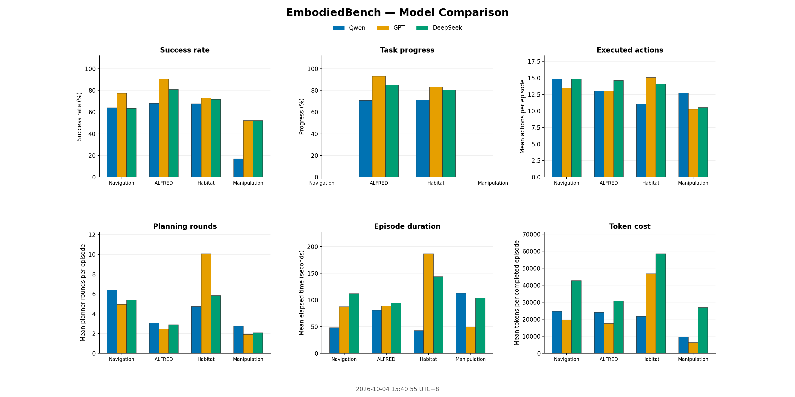
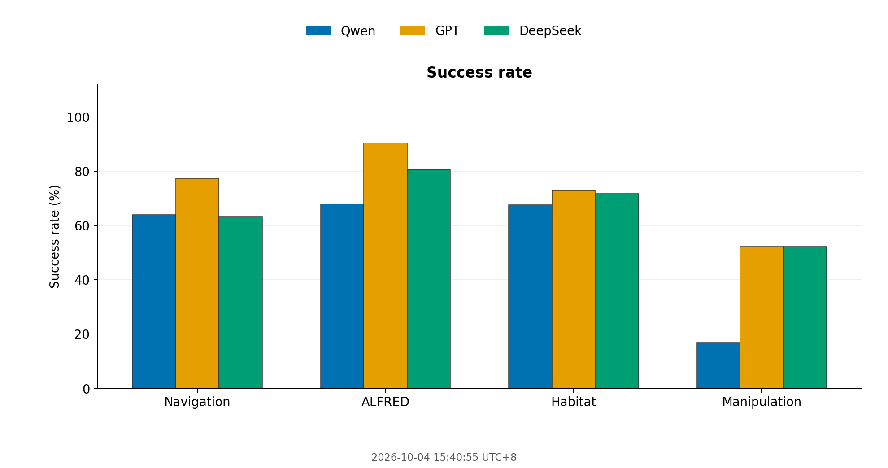
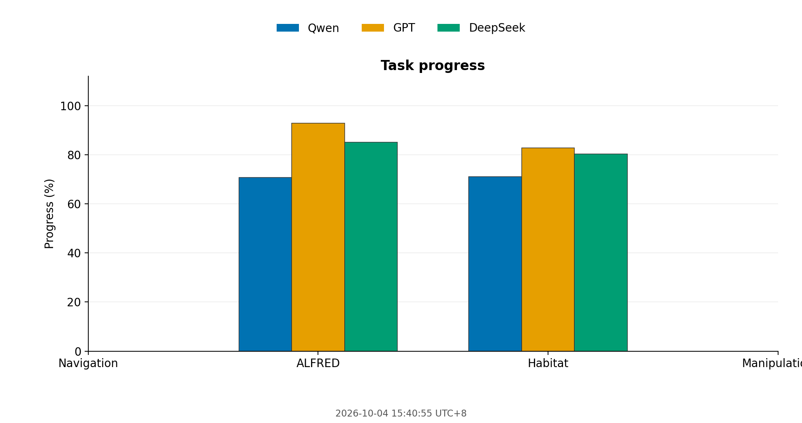
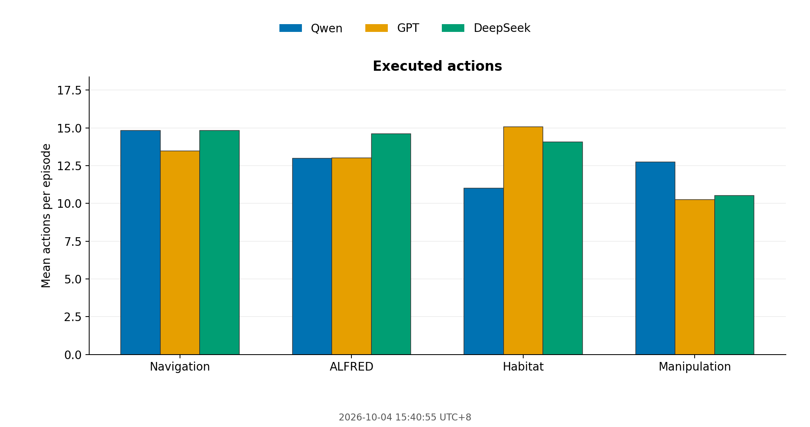
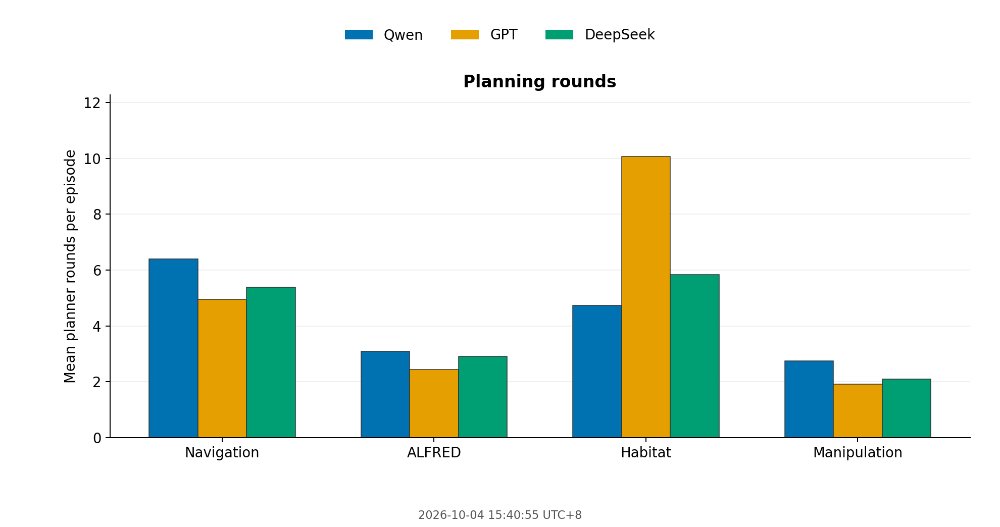
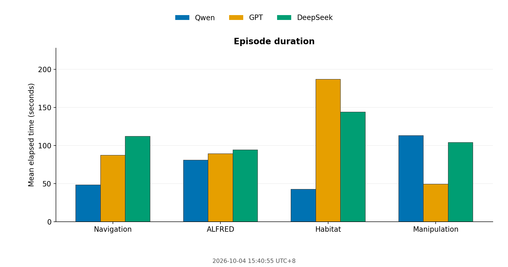
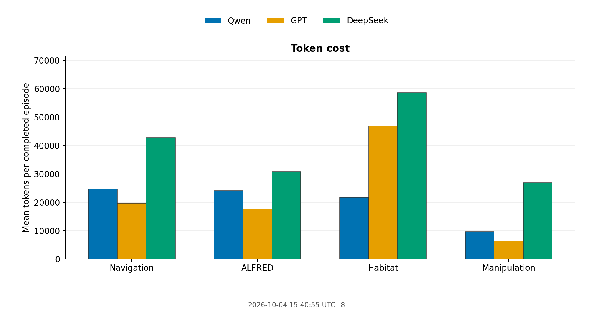

2026-10-04 15:40:55 UTC+8

| model | environment | status | completed_episodes | successful_episodes | success_rate | mean_reward | mean_avg_reward | mean_task_progress | mean_subgoal_reward | mean_num_steps | mean_planner_steps | mean_planner_output_error | mean_num_invalid_actions | mean_num_invalid_action_ratio | mean_episode_elapsed_seconds | prompt_tokens | completion_tokens | total_tokens | reasoning_tokens | mean_tokens_per_completed_episode |
|---|---|---|---|---|---|---|---|---|---|---|---|---|---|---|---|---|---|---|---|---|
| qwen3.8-27b | eb-nav | finished | 300 | 192 | 0.640 | 0.057 |  |  |  | 14.840 | 6.393 | 0.000 |  |  | 48.120 | 6709824 | 683843 | 7393667 |  | 24645.557 |
| qwen3.8-27b | eb-alf | finished | 300 | 204 | 0.680 | 1.099 |  | 0.707 |  | 12.987 | 3.083 | 0.030 | 1.750 | 0.100 | 80.871 | 6702812 | 519925 | 7222737 |  | 24075.790 |
| qwen3.8-27b | eb-hab | finished | 300 | 203 | 0.677 | 1.809 |  | 0.711 | 0.483 | 11.023 | 4.737 | 0.023 | 3.270 | 0.212 | 42.484 | 5844485 | 678757 | 6523242 |  | 21744.140 |
| qwen3.8-27b | eb-man | running | 131 | 22 | 0.168 | 0.000 | -0.114 |  |  | 12.756 | 2.740 | 0.000 |  |  | 112.790 | 1045103 | 217963 | 1263066 |  | 9641.725 |
| gpt-6.1-sol | eb-nav | finished | 300 | 232 | 0.773 | 0.070 |  |  |  | 13.467 | 4.957 | 0.000 |  |  | 87.244 | 5285632 | 595140 | 5880772 | 94235 | 19602.573 |
| gpt-6.1-sol | eb-alf | finished | 300 | 271 | 0.903 | 1.296 |  | 0.929 |  | 13.010 | 2.440 | 0.000 | 0.807 | 0.042 | 89.146 | 4926202 | 331837 | 5258039 | 45920 | 17526.797 |
| gpt-6.1-sol | eb-hab | finished | 300 | 219 | 0.730 | 1.852 |  | 0.828 | 0.533 | 15.067 | 10.067 | 0.000 | 2.067 | 0.111 | 186.694 | 13018105 | 1026400 | 14044505 | 203241 | 46815.017 |
| gpt-6.1-sol | eb-man | finished | 228 | 119 | 0.522 |  | 0.090 |  |  | 10.254 | 1.908 | 0.000 |  |  | 49.085 | 1190171 | 251373 | 1441544 | 44488 | 6322.561 |
| deepseek-flash | eb-nav | finished | 300 | 190 | 0.633 | 0.057 |  |  |  | 14.833 | 5.390 | 0.003 |  |  | 112.031 | 5883080 | 6933568 | 12816648 | 6273181 | 42722.160 |
| deepseek-flash | eb-alf | finished | 300 | 242 | 0.807 | 1.140 |  | 0.851 |  | 14.617 | 2.897 | 0.003 | 1.403 | 0.067 | 94.051 | 6005860 | 3220908 | 9226768 | 2771973 | 30755.893 |
| deepseek-flash | eb-hab | finished | 300 | 215 | 0.717 | 1.879 |  | 0.803 | 0.517 | 14.077 | 5.840 | 0.000 | 4.067 | 0.222 | 143.804 | 7714691 | 9851873 | 17566564 | 9032859 | 58555.213 |
| deepseek-flash | eb-man | failed | 23 | 12 | 0.522 |  | 0.060 |  |  | 10.522 | 2.087 | 0.000 |  |  | 103.723 | 121970 | 529362 | 651332 | 506865 | 26874.652 |

